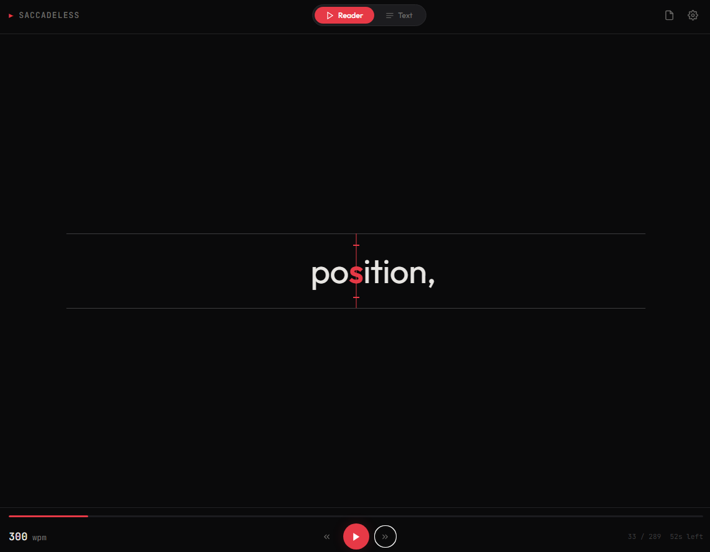
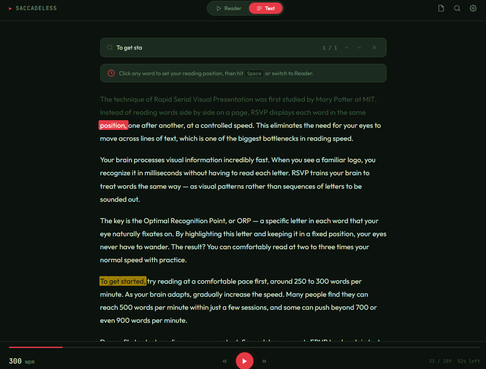
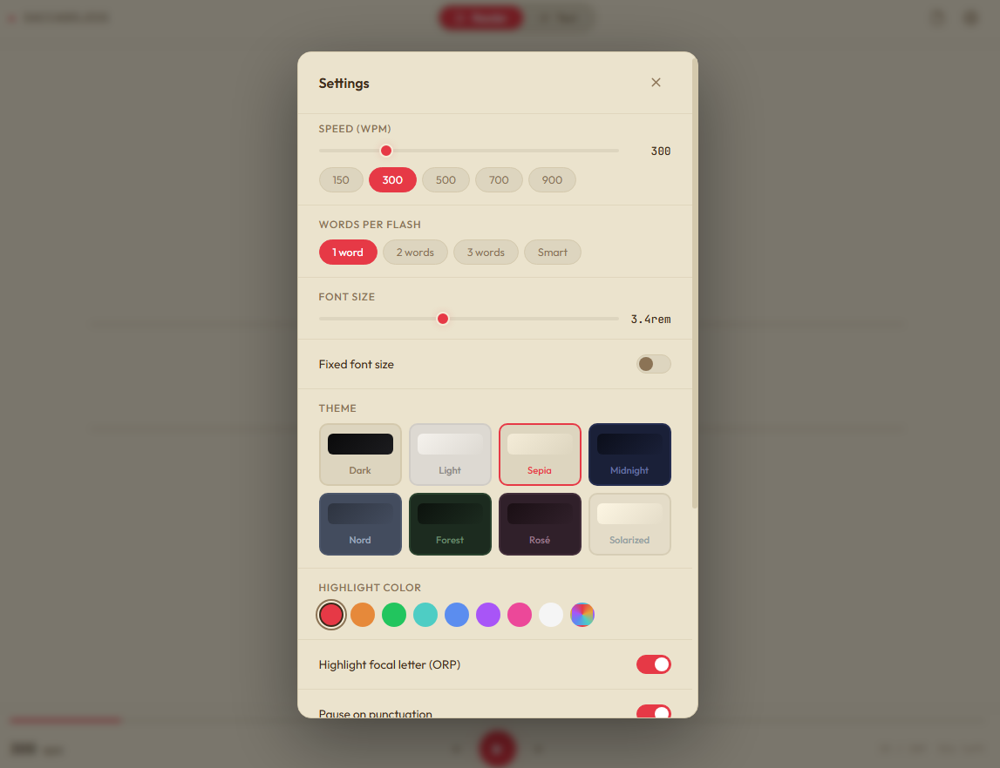

# Saccadeless

A single-file RSVP (Rapid Serial Visual Presentation) speed reader. No dependencies, no build step — just one HTML file. Try online here - https://dobrosketchkun.github.io/saccadeless/



## What it does

Words appear one at a time (or in small groups) at a fixed focal point, eliminating the eye movement that slows down traditional reading. A highlighted letter (the Optimal Recognition Point) anchors your gaze at the exact center of the display.

The average reading speed is around 238 words per minute. With RSVP, most people can comfortably reach 500+ WPM after a short adjustment period.

## Features

**File format support** — EPUB, TXT, HTML, Markdown. Drag and drop, browse, or paste from clipboard.

**Reader / Text mode toggle** — Switch between RSVP playback and a full-text view. Click any word in text mode to set your reading position. Useful for skipping front matter, tables of contents, or jumping to a specific chapter.



**Smart chunking** — Dynamically groups 1-4 words per flash based on visual symmetry around the focal point. Short words cluster together, long words stand alone. Adjustable character budget and sentence-aware mode that never splits across sentence boundaries.

**ORP centering** — The highlighted letter is always pinned to the exact center of the screen. Words shift left and right around it, keeping your eyes perfectly still.

**Themes** — Dark, Light, Sepia, Midnight, Nord, Forest, Rose, Solarized. Each works with any of the accent colors.

**Accent colors** — 8 presets (red, amber, green, teal, blue, purple, pink, white) plus a custom color picker.



**Pacing controls** — Automatic pauses on punctuation, sentence endings, and paragraph breaks. Configurable per toggle.

**Keyboard driven** — Space to play/pause, arrows for navigation (Ctrl+arrows for single-word stepping), up/down for speed adjustment. Full shortcut list in settings.

## Usage

Open `index.html` in any modern browser. That's it.

To read a file, do any of:
- Drag and drop it onto the window
- Click the file icon or press O
- Paste text with Ctrl+V

EPUB files automatically open in text mode so you can pick your starting position.

## Keyboard shortcuts

| Action        | Key          |
|---------------|--------------|
| Play / Pause  | Space        |
| Speed up      | Up arrow     |
| Slow down     | Down arrow   |
| Back 10 words | Left arrow   |
| Fwd 10 words  | Right arrow  |
| Back 1 word   | Ctrl + Left  |
| Fwd 1 word    | Ctrl + Right |
| Toggle view   | Tab          |
| Open file     | O            |
| Settings      | ,            |
| Search        | Ctrl + F     | 
| Restart       | R            |

## Settings

- **WPM** — 60 to 1200, with presets at 150, 300, 500, 700, 900
- **Words per flash** — 1, 2, 3, or Smart (symmetry-optimized dynamic chunking)
- **Smart mode options** — Max character width (8-30), sentence boundary awareness
- **Font size** — Adjustable with optional fixed-size mode that prevents scaling on multi-word flashes
- **Theme** — 8 themes with visual previews
- **Highlight color** — 8 presets + custom picker
- **Toggles** — ORP highlight, punctuation pauses, paragraph pauses, focus crosshair

## Technical notes

Single HTML file, no build tools, no frameworks. Uses JSZip (loaded from CDN) for EPUB parsing. Everything else is vanilla JS/CSS.

EPUB parsing follows the OPF spine order and strips scripts/styles from content documents. Falls back to alphabetical file order if the OPF is missing or malformed.

### Running fully offline
 
JSZip is loaded from `cdnjs.cloudflare.com` by default. To use it locally:
 
1. Download jszip.min.js from https://cdnjs.cloudflare.com/ajax/libs/jszip/3.10.1/jszip.min.js
2. Place it next to `pacelit.html`
3. Change the script tag at the top from:
   ```html
   <script src="https://cdnjs.cloudflare.com/ajax/libs/jszip/3.10.1/jszip.min.js"></script>
   ```
   to:
   ```html
   <script src="jszip.min.js"></script>
   ```
 
After that, everything runs offline with no network requests. JSZip is only needed for EPUB files — TXT, HTML, and Markdown work without it.
